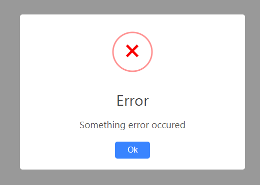
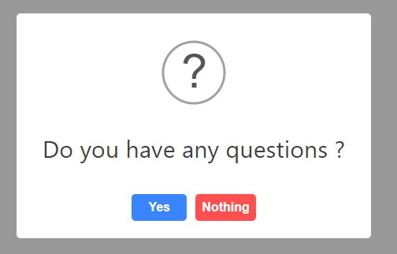
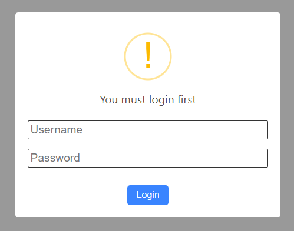

# Custom-Alert

Custom-alert is a lightweight alternative for sweetalert.

> This library doest not support IE

This library inspire by [sweetalert](https://sweetalert.js.org/)

# Installation

NPM

```bash
npm i calerts
```

Unpkg (9kb)

```html
<script src="https://unpkg.com/calerts"></script>
```

Unpkg Unbabel Version (8kb)

```html
<script src="https://unpkg.com/calerts@latest/dist/calert.unbabel.min.js"></script>
```

# Usage

```javascript
calerts('Error', 'Something error occured', 'error')
```



## sample 2

```javascript
calert({
  icon: 'question',
  title: 'Do you have any questions ?',
  confirmButton: 'Yes',
  cancelButton: 'Nothing',
}))
```



## sample 3

```javascript
calerts({
  icon: "warning",
  text: "You must login first",
  inputs: {
    username: {
      type: "text",
      placeholder: "Username"
    },
    password: {
      type: "password",
      placeholder: "Password",
    }
  }
  confirmButton: "Login"
})
```


